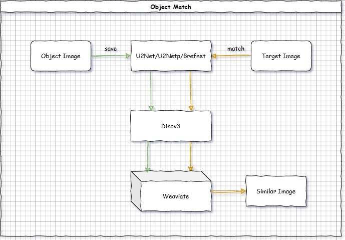

# KoalaqVision

ONNX-based dual-mode visual retrieval system supporting object recognition and face recognition.

[](LICENSE.txt)
[](https://www.python.org/)
[](https://hub.docker.com/)

English | [简体中文](README_CN.md)

## Introduction

KoalaqVision is an industrial-grade visual retrieval system that provides two retrieval modes:

- **Object Mode**: Image-to-image search, suitable for industrial parts, daily items, and other object retrieval
- **Face Mode**: Face recognition, supports 1:N face search

The system implements CPU inference based on ONNX Runtime. All deep learning models have been converted to ONNX format, enabling efficient operation without GPU.

## Deployment Architecture Support

- [x] x86_64
- [x] arm64

For detailed test reports, see: [Test Report](./docs/en/test-report.md)

## Core Features

- **Dual-mode Architecture**: Single system supporting both object retrieval and face recognition, switchable via configuration
- **CPU Optimized**: All models based on ONNX Runtime, optimized for CPU inference environments
- **Industrial-grade Models**: Uses mature open-source models including DINOv3, InsightFace, U2Net
- **Vector Retrieval**: Based on Weaviate vector database, supports millisecond-level similarity search
- **Complete API**: RESTful interface + Swagger documentation
- **Web Interface**: Simple test management interface based on Gradio
- **Containerized Deployment**: One-click deployment using docker compose, no configuration required

## Model Selection

### Object Mode

**Foreground Extraction Models**:
- **U2Net**: General foreground segmentation model, balances speed and accuracy
- **BiRefNet**: High-precision foreground extraction, suitable for complex background scenes, slower ONNX speed

**Feature Extraction Models**:
- **DINOv3 Series**: vits/vitl/vith for feature extraction

All models have been converted to ONNX format, supporting efficient CPU inference.

### Face Mode

**Liveness Detection Model**:
- **Silent-Face-Anti-Spoofing (MiniFASNet)**: Anti-spoofing protection, converted to [ONNX](https://github.com/QingHeYang/Silent-Face-Anti-Spoofing-onnx)

**Face Recognition Model Packs** (InsightFace):
- **buffalo_s**: Lightweight model pack, 159MB
- **buffalo_l**: Standard model pack, 326MB
- **antelopev2**: Latest model pack, 326MB (recommended)

**Features**:
- 1:N face search

## Quick Start

### Docker Deployment (Recommended)

```bash
# Clone repository
git clone https://github.com/QingHeYang/KoalaqVision.git
cd KoalaqVision

# Start services (includes Weaviate vector database)
docker compose -f deploy/docker-compose.yml up -d
```

**Access Services:**

- **Gradio UI**: http://localhost:10770/ui
  - Simple test interface
  - Upload images and interactively test search functionality

- **Swagger API Documentation**: http://localhost:10770/docs

### Local Deployment

```bash
# Install dependencies
pip install -r requirements.txt

# Download models (required)
# See docs/models.md

# Start service
./start.sh
```

## Configuration

KoalaqVision supports configuration via environment variables.

**Local Deployment**: Edit `.env` file
**Docker Deployment**: Add environment variables in `docker-compose.yml`

**Quick Example** (Switch to Face Mode):

```yaml
# In docker-compose.yml
environment:
  - APP_MODE=face
  - FACE_MODEL_NAME=antelopev2
  - ENABLE_LIVENESS=true
```

For complete configuration options, see [Configuration Guide](docs/en/configuration.md).

## System Flow

Object Matching:


Face Matching:


## Performance Metrics

See test report for details

## Documentation

- [Configuration Guide](docs/en/configuration.md) - Complete configuration reference
- [API Documentation](docs/en/api.md) - Complete API endpoint documentation
- [Quick Start](docs/en/quickstart.md) - 5-minute quick start
- [Model Download](docs/en/models.md) - Download and configure AI models

## Model Sources

All models are from open-source projects:

**DINOv3** (Meta AI)
- Self-supervised Vision Transformer model
- Paper: https://arxiv.org/abs/2304.07193
- Repository: https://github.com/facebookresearch/dinov3
- License: DINOv3's own license, this project inherits that license

**U2Net / BiRefNet** (Foreground Segmentation)
- U2Net: https://github.com/xuebinqin/U-2-Net
- BiRefNet: https://github.com/ZhengPeng7/BiRefNet

**InsightFace** (Face Recognition)
- Website: https://insightface.ai/
- Repository: https://github.com/deepinsight/insightface
- License: Pre-trained models for academic research only, this project inherits that statement

**Silent-Face-Anti-Spoofing** (Liveness Detection)
- Repository: https://github.com/minivision-ai/Silent-Face-Anti-Spoofing
- License: MIT

Thanks to the excellent open-source models from the above projects, which have laid a solid foundation for this project.

## License

This project is licensed under Apache License 2.0 - see [LICENSE.txt](LICENSE.txt) file for details.

Third-party model licenses may vary, please refer to their respective projects.

## Acknowledgments

Thanks to the following open-source projects:

- **FastAPI & Gradio** - Web framework and UI
- **Weaviate** - Vector database
- **ONNX Runtime** - Inference engine
- **Meta AI, InsightFace, MiniVision** - AI models

## Contact

- Author: QingHeYang
- GitHub: [@QingHeYang](https://github.com/QingHeYang)
- Issues: [Submit Issues](https://github.com/yourusername/KoalaqVision/issues)