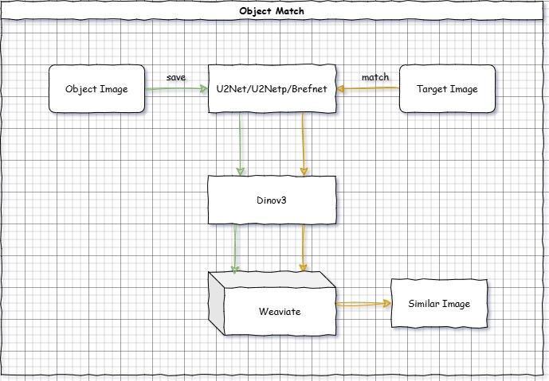
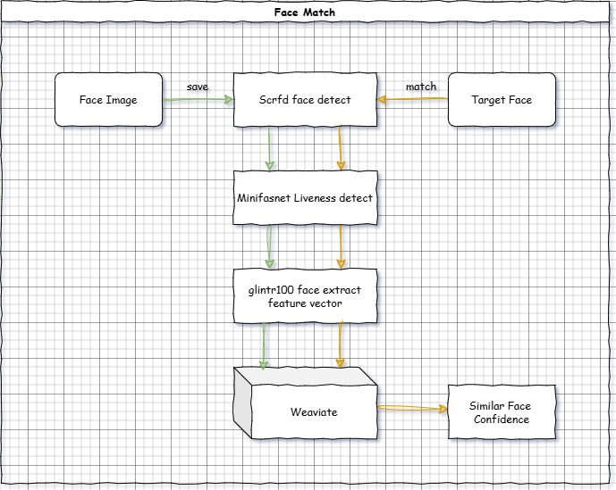

# KoalaqVision

基于 ONNX 的双模式视觉检索系统，支持物品识别和人脸识别。

[](LICENSE.txt)
[](https://www.python.org/)
[](https://hub.docker.com/)

[English](README.md) | 简体中文

## 项目简介

KoalaqVision 是一个工业级视觉检索系统，提供两种检索模式：

- **Object Mode（物品模式）**：以图搜图，适用于工业零件、日用品等物品检索
- **Face Mode（人脸模式）**：人脸识别，支持 1:N 人脸搜索

系统基于 ONNX Runtime 实现 CPU 推理，所有深度学习模型均已转换为 ONNX 格式，无需 GPU 即可高效运  
行。
  
## 项目部署架构支持  

- [x] x84_64  
- [x] arm64  

具体的测试报告详见：[测试报告](./docs/zh/test-report.md)  


## 核心特性

- **双模式架构**：单一系统支持物品检索和人脸识别，通过配置切换
- **CPU 优化**：所有模型基于 ONNX Runtime，适配 CPU 推理环境
- **工业级模型**：采用 DINOv3、InsightFace、U2Net 等成熟开源模型
- **向量检索**：基于 Weaviate 向量数据库，支持毫秒级相似度搜索
- **完整 API**：RESTful 接口 + Swagger 文档
- **Web 界面**：简单的测试管理界面，基于Gradio
- **容器化部署**：使用docker compose部署，一键启动，无需配置  

## 模型选择

### Object Mode（实物检索）

**前景提取模型**：
- **U2Net**：通用前景分割模型，平衡速度和精度
- **BiRefNet**：高精度前景提取，适用于复杂背景场景，onnx速度慢

**特征提取模型**：
- **DINOv3系列模型**：vits/vitl/vith，用于提取特征值

所有模型均已转换为 ONNX 格式，支持 CPU 高效推理。

### Face Mode（人脸识别）

**活体检测模型**：
- **Silent-Face-Anti-Spoofing (MiniFASNet)**：防翻拍攻击，已转换为 [ONNX](https://github.com/QingHeYang/Silent-Face-Anti-Spoofing-onnx)

**人脸识别模型包**（InsightFace）：
- **buffalo_s**：轻量级模型包，159MB
- **buffalo_l**：标准模型包，326MB
- **antelopev2**：最新模型包，326MB（推荐）

**功能支持**：
- 1:N 人脸搜索

## 快速开始

### Docker 部署（推荐）

```bash
# 克隆项目
git clone https://github.com/QingHeYang/KoalaqVision.git
cd KoalaqVision

# 启动服务（包含 Weaviate 向量数据库）
docker compose -f deploy/docker-compose.yml up -d
```

**访问服务：**

- **Gradio UI**: http://localhost:10770/ui
  - 简单的测试界面
  - 上传图片并交互式测试搜索功能

- **Swagger API 文档**: http://localhost:10770/docs

### 本地运行

```bash
# 安装依赖
pip install -r requirements.txt

# 下载模型（必须）
# 见 docs/models.md

# 启动服务
./start.sh
```

## 配置说明

KoalaqVision 支持通过环境变量进行配置。

**本地部署**：编辑 `.env` 文件
**Docker 部署**：在 `docker-compose.yml` 中添加环境变量

**快速示例**（切换到人脸模式）：

```yaml
# 在 docker-compose.yml 中
environment:
  - APP_MODE=face
  - FACE_MODEL_NAME=antelopev2
  - ENABLE_LIVENESS=true
```

完整的配置选项请查看 [配置指南](docs/zh/configuration.md)。

## 系统流程
实物匹配：
  

人脸匹配：  


## 性能指标

详见测试报告

## 文档

- [配置指南](docs/zh/configuration.md) - 完整的配置参考
- [API 接口文档](docs/zh/api.md) - 完整的 API 端点说明
- [快速开始](docs/zh/quickstart.md) - 5分钟快速上手
- [模型下载](docs/zh/models.md) - 下载和配置 AI 模型

## 模型来源

所有模型均来自开源项目：

**DINOv3** (Meta AI)
- 自监督视觉 Transformer 模型
- 论文：https://arxiv.org/abs/2304.07193
- 仓库：https://github.com/facebookresearch/dinov3
- 许可证：Dinov3 自有许可，本项目继承该许可

**U2Net / BiRefNet**（前景分割）
- U2Net: https://github.com/xuebinqin/U-2-Net  
- BiRefNet: https://github.com/ZhengPeng7/BiRefNet  

**InsightFace**（人脸识别）
- 官网：https://insightface.ai/
- 仓库：https://github.com/deepinsight/insightface
- 许可证：预训练模型仅支持学习研究，本项目继承该声明

**Silent-Face-Anti-Spoofing**（活体检测）
- 仓库：https://github.com/minivision-ai/Silent-Face-Anti-Spoofing
- 许可证：MIT  

感谢上述上述项目带来的优秀开源模型，为本项目打下了坚实的基础

## 许可证

本项目采用 Apache License 2.0 许可证 - 详见 [LICENSE.txt](LICENSE.txt) 文件。

第三方模型许可证可能有所不同，请参考各自项目。

## 致谢

感谢以下开源项目：

- **FastAPI & Gradio** - Web 框架和 UI
- **Weaviate** - 向量数据库
- **ONNX Runtime** - 推理引擎
- **Meta AI, InsightFace, MiniVision** - AI 模型

## 联系方式

- 作者：QingHeYang
- GitHub：[@QingHeYang](https://github.com/QingHeYang)
- Issues：[提交问题](https://github.com/yourusername/KoalaqVision/issues)
